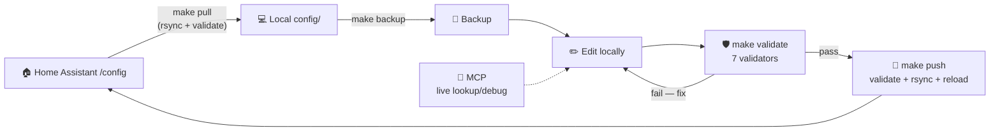
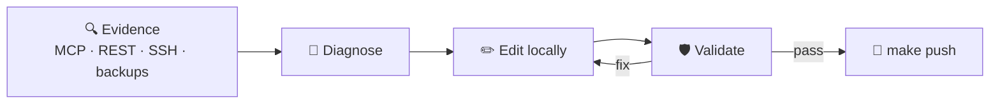
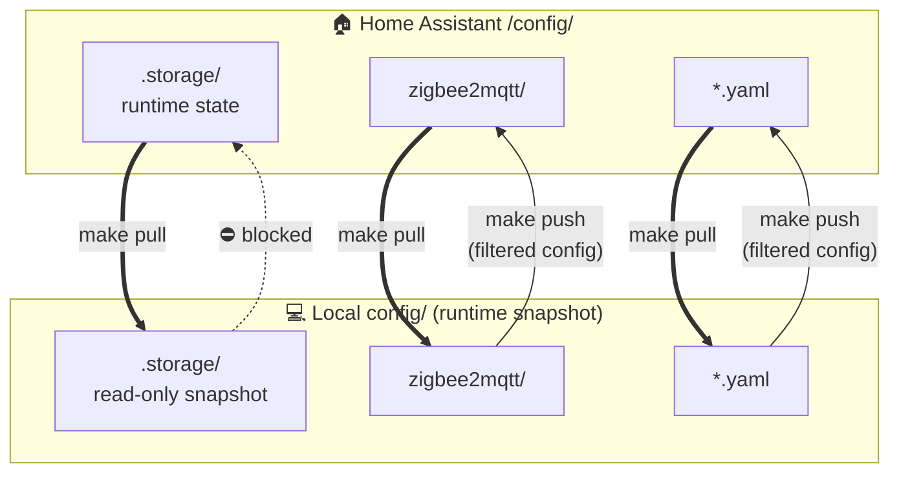
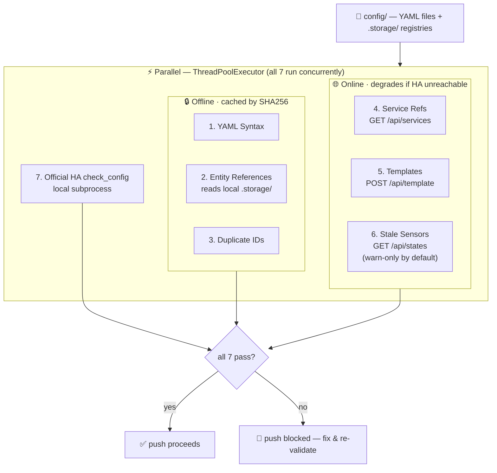

# AI Home Assistant Config Manager

A toolkit for managing Home Assistant configurations — automated validation, safe deployment, round-trip YAML editing. Designed to work alongside AI coding assistants, but fully usable standalone.

## ✨ Features

- 🛡️ **Multi-Layer Validation** — YAML syntax, entity references, and official HA `check_config` — runs before any push
- ✏️ **Safe YAML Editing** — `ha_cli edit` preserves comments, formatting, and key ordering (ruamel.yaml round-trip)
- ⚡ **Validator Caching** — SHA256-based caching skips re-validation for file-backed validators when their inputs haven't changed
- 🚀 **Safe Deployments** — `make push` validates first, blocks invalid configs from reaching HA
- 🤖 **AI Assistant Ready** — MCP server integration, instruction files, and pre-built skills for AI coding assistants
- 🪶 **Token-Efficient Output** — Compact summary mode (auto-detected for pipes/agents), field projection (`--pick`), result limiting (`--first`, `--max-chars`), and guardrails to prevent AI context overload
- 📦 **Importable Python Modules** — `HAClient`, `YAMLEditor`, and validators for scripts and tests
- 💾 **Backup System** — Timestamped config backups, changelog tooling, and full-text search
- 🔎 **Upgrade Readiness** — `check-upgrade` skill reviews intervening Home Assistant releases for breaking changes and instance-relevant features

## 🔄 How It Works

### ✏️ Creating & Editing Automations



> **1. Pull** — `make pull` syncs config from HA via rsync, triggers validation for integrity.
> **2. Backup** — Run `make backup` explicitly before making changes; it creates a timestamped tarball and attempts changelog generation.
> **3. Edit** — Modify config files locally. `ha_cli edit` preserves YAML formatting. MCP tools provide live lookups and debugging data.<br>
> **4. Validate** — `make validate` runs 7 validators: YAML syntax, entity/device/area references, duplicate automation IDs, service references, Jinja2 template linting, stale sensor detection, and official HA `check_config`.
> **5. Push** — `make push` validates then rsyncs to HA, blocking broken configs from reaching the server. HA reloads the new configuration automatically.

### 🔍 Debugging



> **1. Pull** — `make pull` syncs the latest config to ensure you're investigating the current state.
> **2. Search backups** — `make backup-search PATTERN='text'` finds when an entity or automation last changed.
> **3. Compare versions** — Extract old config from a backup tarball (`tar -xzOf backups/... config/automations.yaml`) and diff against the current version.
> **4. Inspect logs** — Prefer MCP log/history tools; use `ssh homeassistant "ha core logs --follow"` or the REST API as fallbacks.<br>
> **5. Trace root cause** — Use MCP tools for live entity state, automation traces, and template rendering.
> **6. Fix, validate, push** — Once the root cause is found, apply the fix and resume the normal create/edit flow above.

### 📡 Access Points

The toolkit communicates with Home Assistant through four distinct channels, each serving a different purpose:

| Access Method | Protocol | Config | Used By | Why It's Needed |
|---------------|----------|--------|---------|-----------------|
| **rsync** over SSH | SSH/SFTP | `HA_HOST` | `make pull`, `make push` | Bulk transfer of the config directory tree. Rsync is incremental (only changed files); it pulls `.storage/` registries and YAML/integration config, while push applies `.rsync-excludes-push` and excludes `.storage/`. |
| **REST API** | HTTP (port 8123) | `HA_URL` + `HA_TOKEN` | `HAClient`, `ha_cli curl`, `make reload`, ServiceValidator, TemplateValidator | Standard HA programmatic interface. Service calls, state queries, config reloads, and template rendering. Validators query `/api/services` and `/api/template` at validation time to catch issues before they reach the server. |
| **MCP Server** | HTTP (port 9583) | `HA_MCP_URL` or `.ha-mcp-url` for OpenCode | AI assistants (opencode, Claude Code) | High-level natural-language HA control designed for AI agents. 88+ tools for entity listing, config inspection, automation management, history queries, and service calls — without needing raw API requests. Used by the automation and debugging workflows; the backup workflow uses Make/CLI commands. |
| **SSH shell** | SSH | `HA_HOST` | `ha core logs`, addon restart, Lovelace edits | Server-side commands that the REST API can't do. Log viewing (`ha core logs --follow`), addon management (`ha apps restart` for Frigate/Z2M), and direct `.storage/` file edits for Lovelace (which returns 404 from the REST API in storage mode). |

> **One host, four channels.** `HA_HOST` powers both rsync and SSH shell via the same [Advanced SSH & Web Terminal](https://github.com/hassio-addons/addon-ssh) add-on. `HA_URL` and `HA_MCP_URL` are separate HTTP endpoints on the same HA instance.

#### 🔄 Rsync Directionality (Push vs Pull)

Push and pull use **asymmetric exclude files** — the most important safety property of the toolkit:



> **Asymmetric by design.** Pull is permissive — it snapshots `.storage/` registries (minus excluded auth/secrets files) for local reference so the entity-reference validator can check entity existence offline. Push transfers the local config tree subject to `.rsync-excludes-push`; it **never** touches `.storage/` (HA-managed runtime state: integration configs, entity/device registries, UI dashboards, auth). Pushing `.storage/` would overwrite HA's live state with a stale snapshot. Zigbee2MQTT pulls its configuration and coordinator backup, while push excludes its database, state, logs, and coordinator backup.

## 🚀 Quick Start

### 📥 1. Clone and Set Up
```bash
git clone git@github.com:stephenwong/ai-homeassistant.git
cd ai-homeassistant
make setup  # Installs dependencies via uv
```

### ⚙️ 2. Configure Connection
```bash
cp .env.example .env
# Edit .env with your actual Home Assistant details
```

The `.env` file should contain:
```bash
# Home Assistant API
HA_TOKEN=your_home_assistant_token
HA_URL=http://your_homeassistant_host:8123

# MCP Server (for AI assistant integration)
HA_MCP_URL=http://your_homeassistant_ip:9583/private_your_token_here

# SSH Configuration for rsync operations
HA_HOST=your_homeassistant_host
HA_REMOTE_PATH=/config/

# Local Configuration (optional — defaults provided)
LOCAL_CONFIG_PATH=config/
BACKUP_DIR=backups
```

### 🔑 3. Set Up SSH Access

Install the [Advanced SSH & Web Terminal](https://github.com/hassio-addons/addon-ssh) add-on for Home Assistant, which provides SSH/SFTP access needed for rsync operations.

<details>
<summary><strong>Click to expand SSH setup instructions</strong></summary>

##### Generate SSH Key Pair (if you don't have one)
```bash
ssh-keygen -t ed25519 -f ~/.ssh/homeassistant -C "your-email@example.com"
```

##### Configure Advanced SSH & Web Terminal Add-on

1. Install the add-on in Home Assistant
2. Configure with your public key:
```yaml
username: root
password: ""
authorized_keys:
  - >-
    ssh-ed25519 AAAAC3NzaC1lZDI1NTE5AAAA... your-email@example.com
sftp: true
compatibility_mode: false
allow_agent_forwarding: false
allow_remote_port_forwarding: false
allow_tcp_forwarding: false
```
3. Start the add-on

##### Configure SSH Client

Create or edit `~/.ssh/config`:
```
Host homeassistant
  HostName homeassistant.local
  User root
  IdentityFile ~/.ssh/homeassistant
  StrictHostKeyChecking no
```

##### Test Connection
```bash
ssh homeassistant
```

</details>

### 🎫 4. Get Your Home Assistant Token

1. Home Assistant → Settings → People → Your Profile
2. Scroll to "Long-lived access tokens" → Create Token
3. Copy the token into `.env` as `HA_TOKEN`

### ⬇️ 5. Pull Your Configuration
```bash
make pull  # Downloads your actual HA config
```

### 🛠️ 6. Work with Your Configuration

Edit configs locally with full validation, push back when ready:
```bash
make push  # Validates then uploads to HA
```

## 📁 Project Structure

```
├── tools/                       # Validation and management scripts
│   ├── ha_cli.py                # Single CLI entry point
│   ├── commands/                # CLI subcommands (curl, edit, reload, stale-sensors, trace, validate)
│   ├── ha/                      # Shared modules
│   │   ├── client.py            # HAClient — REST API client
│   │   └── yaml_editor.py       # YAMLEditor — round-trip YAML editing
│   ├── validators/              # Validators (base.py, duplicate_ids.py, entity_definitions.py, ha_official.py, ...)
│   ├── reload_config.py         # HA config reload via API
│   ├── cache.py                 # SHA256 file-hash caching
│   ├── common.py                # Shared utilities (re-exports from validators/, argparse types)
│   ├── output_shape.py          # Shared JSON output-shaping (--first/--pick/--max-chars)
│   ├── generate_changelog.py    # Backup changelog generation
│   ├── search_backups.py        # Full-text search across backups
│   └── prune_backups.py         # Smart backup retention pruning
├── tests/                       # Unit tests (pytest)
├── .github/                     # CI/CD workflows (lint, test, CodeQL)
├── .agents/skills/              # Harness-agnostic AI skill workflows
├── .pre-commit-config.yaml      # Pre-commit hooks (Ruff, mypy, codespell, repository checks)
├── AGENTS.md                    # AI assistant instructions (harness-agnostic)
├── README-DEV.md                # Development environment setup
├── opencode.json                # MCP server configuration for opencode
├── .env.example                 # Environment configuration template
├── Makefile                     # Management commands (pull, push, validate, etc.)
├── Makefile.dev                 # Development-specific commands
├── uv.lock                      # Locked dependencies
└── pyproject.toml               # Python project configuration
```

> **Runtime directories** (gitignored, created by setup commands):
> - `config/` — HA configuration, created by `make pull` (includes `automations.yaml`, `scripts.yaml`, `scenes.yaml`, `configuration.yaml`, `.storage/`, `zigbee2mqtt/`)
> - `backups/` — Timestamped config backups, created by `make backup`
> - `frigate/` — Frigate NVR config snapshot; `frigate/config.yml` is ignored

## 🛠️ Commands

### 🎮 Primary CLI (`ha_cli`)
```bash
# Validation
uv run python tools/ha_cli.py validate              # Run all validators
uv run python tools/ha_cli.py validate --force      # Force re-run (skip cache)
uv run python tools/ha_cli.py validate --quiet      # Suppress success output

# YAML Editing
uv run python tools/ha_cli.py edit automations                 # List all automations
uv run python tools/ha_cli.py edit automations "Name"          # Show one automation
uv run python tools/ha_cli.py edit automations --add '{"alias":"...","trigger":[],"action":[]}'
uv run python tools/ha_cli.py edit automations "Name" --set mode=single icon=mdi:shield
uv run python tools/ha_cli.py edit automations "Name" --remove

# API Calls
uv run python tools/ha_cli.py curl /api/states                # Guardrail: count+hint when piped
uv run python tools/ha_cli.py curl /api/states --pick state,entity_id
uv run python tools/ha_cli.py curl /api/states --entity sensor.temp
uv run python tools/ha_cli.py curl /api/states --domain light --first 5
uv run python tools/ha_cli.py curl /api/states --max-chars 500
uv run python tools/ha_cli.py curl /api/states --no-guard          # bypass guardrail and default max-chars cap
uv run python tools/ha_cli.py curl /api/services/light/turn_on --post --data '{"entity_id":"light.kitchen"}'

# Automation Traces
uv run python tools/ha_cli.py trace                             # list all automation traces
uv run python tools/ha_cli.py trace automation.outside_downlights_startup_off  # specific automation trace
uv run python tools/ha_cli.py trace --pretty                    # pretty-print trace
uv run python tools/ha_cli.py trace --first 5                   # first 5 traces only (after dedupe in summary)

# Summary mode: dedupes by item_id (adds runs field when N>1), drops config/blueprint_inputs
#   from single-entity traces, and strips changed_variables.this.attributes
#   (updated: strips .attributes from ALL changed_variables dicts, not just this;
#   --max-chars now enforced on single-entity dicts via step-key dropping)
uv run python tools/ha_cli.py trace --summary

# Stale Sensor Detection
uv run python tools/ha_cli.py stale-sensors                     # Find stale sensors (summary mode auto)
uv run python tools/ha_cli.py stale-sensors --no-summary        # Verbose mode

# Reload
uv run python tools/ha_cli.py reload
```

### 🏗️ Make Targets

| Command | Purpose |
|---------|---------|
| `make pull` | Sync config from HA (includes Z2M and Frigate configs) |
| `make push` | Push config (validates first, then rsyncs) |
| `make validate` | Run all validation tests |
| `make backup` | Create timestamped backup and attempt changelog generation |
| `make setup` | Install Python dependencies via uv |
| `make status` | Show config/filesystem status and an entity-reference summary |
| `make reload` | Reload HA config via API (no push) |

| `make lint` | Run Ruff format check, Ruff lint, and mypy |
| `make lint-fix` | Auto-fix Ruff format and lint issues (does not run mypy) |
| `make backup-search PATTERN='text'` | Search all backups for a pattern |
| `make changelog BACKUP='path'` | Generate changelog for a backup |
| `make test-ssh` | Test SSH connection to HA |
| `make clean` | Remove Python bytecode and log files |

### 💾 Backup Pruning (`prune_backups.py`)

Smart retention pruning for HA backup archives. **Default is dry-run** — no files are deleted unless `--apply` is passed:

```bash
uv run python tools/prune_backups.py              # dry-run (default; prints plan only)
uv run python tools/prune_backups.py --apply      # actually delete
uv run python tools/prune_backups.py --apply --min-keep 5   # defense-in-depth floor
```

`--dry-run` is accepted as an explicit alias for the default. `--min-keep N` (default 3) refuses to delete if fewer than N backups would remain.

## ✏️ YAML Editing (`ha_cli edit`)

**Prefer `ha_cli edit` over manual YAML editing** — it uses `ruamel.yaml` for round-trip editing that preserves comments, formatting, and key ordering. Operates on `automations.yaml` (list) and `scripts.yaml` (dict).

Edit errors distinguish a missing target (`file not found`), an execution-time read failure (`could not read`), and invalid YAML (`could not parse`).

```bash
# List all automation aliases
uv run python tools/ha_cli.py edit automations

# Show a specific automation
uv run python tools/ha_cli.py edit automations "Turn on Alarm"

# Add a new automation
uv run python tools/ha_cli.py edit automations --add '{"alias":"New Automation","trigger":[],"action":[]}'

# Update fields on an existing automation
uv run python tools/ha_cli.py edit automations "Turn on Alarm" --set mode=single icon=mdi:shield

# Remove an automation
uv run python tools/ha_cli.py edit automations "Old Automation" --remove
```

Programmatic editing is also available:
```python
from tools.ha.yaml_editor import YAMLEditor
editor = YAMLEditor("config/automations.yaml")
editor.add_automation({"alias": "...", "trigger": [...], "action": [...]})
editor.save()
```

## 🛡️ Validation System

Seven layers run on every `make validate` (and before every `make push`):



> **Offline degradation:** When HA is unreachable, online validators degrade instead of failing — Service Refs falls back to a format-only regex check, Templates falls back to brace-balance checking, and Stale Sensors is skipped entirely (also auto-skipped in CI). File-backed validators return instantly on cache hits; live/time-sensitive validators are never cached. Failures are never cached and always re-run.

### 📝 1. YAML Syntax
Validates YAML syntax with HA-specific tags (`!include`, `!secret`, `!input`), file encoding, and basic HA file structures.

### 🔗 2. Entity References
Verifies all entity references exist in your HA instance. Checks device and area references, warns about disabled entities, extracts entities from Jinja2 templates, and recognizes config-defined entities.

### 🆔 3. Duplicate Automation IDs
Detects duplicate `id` values across automations (which silently break triggering and UI editing) and warns about missing `id` fields.

### 🎯 4. Service References
Checks every `service:`/`action:` target in automations and scripts. Malformed services (e.g. `light..turn_on`) fail; unknown services (e.g. `light.turn_onn`, or a dynamically-registered service whose integration is temporarily unloaded) warn. Queries the live HA API; degrades to a format-only check when offline.

### 🧪 5. Jinja2 Template Linting
Renders every template string (`{{ }}` / ``) against HA's `/api/template` endpoint. Syntax errors and unknown filters fail; runtime-context variables yield warnings. Degrades to brace-balance check when offline.

### ⏳ 6. Stale Sensor Validation
Queries the Home Assistant API for sensors stuck in stale states — common with battery-powered Zigbee devices that drop offline while reporting their last-known value. Detects staleness by comparing `last_updated`/`last_changed` timestamps against the current time with a configurable threshold. Default (`HA_STALE_FAIL=0`): passes with warnings. Set `HA_STALE_FAIL=1` or pass `--fail-on-stale` to fail on stale sensors. Automatically skipped in CI.

Malformed timestamps are reported as diagnostics; unexpected timestamp-parser failures propagate for visibility.

### 🏛️ 7. Official HA Validation
Uses Home Assistant's own `check_config`. **"Successful config (partial)"** is the normal local result — some integration packages can't install locally due to version pin differences, but this is expected and doesn't indicate a real config problem.

### ⚡ Validator Caching

Eligible file-backed validators cache results in `config/.cache/validators/` keyed by the SHA256 of dependent-file content plus validator implementation source (including shared `ValidatorBase` behavior). Unchanged dependencies return cached results instantly; live/time-sensitive validators do not cache. Unreadable dependencies and malformed cache records are treated as cache misses.

- **Automatic:** Caching is transparent — no action needed
- **Force refresh:** `ha_cli validate --force` re-runs all validators
- **Only successful results cached:** Failures always re-run
- **Clear cache:** Delete `config/.cache/validators/` with `rm -rf config/.cache/validators/`

## 📦 Importable Modules

For Python scripts and tests, import from the package directly:

```python
from tools.ha.client import HAClient              # REST API client
from tools.ha.yaml_editor import YAMLEditor        # Round-trip YAML editing
from tools.output_shape import apply_output_shape # --first/--pick/--max-chars
from tools.common import positive_int             # argparse type validators
from tools.validators.duplicate_ids import DuplicateIDValidator
from tools.validators.references import ReferenceValidator
from tools.validators.services import ServiceValidator
from tools.validators.templates import TemplateValidator
from tools.validators.ha_official import HAOfficialValidator
from tools.validators.yaml import YAMLValidator
from tools.validators.stale_sensors import StaleSensorValidator
```

`HAClient` is constructed via `HAClient.from_env()` (reads `.env` for `HA_TOKEN`/`HA_URL`). OpenCode reads the MCP URL from the ignored `.ha-mcp-url` file referenced by `opencode.json`.

## 🤖 AI Assistant Integration

This toolkit is designed to work with AI coding assistants. Three components enable this:

### 🔌 MCP Server (ha-mcp)

The [ha-mcp](https://github.com/homeassistant-ai/ha-mcp) add-on provides 88+ MCP tools for natural-language HA control — entity listing, service calls, history, config inspection, automation creation, and more.

**Setup:**
1. Install the "Home Assistant MCP Server" add-on
2. Start it and copy the MCP URL from add-on logs (format: `http://<ip>:9583/private_<token>`)
3. Set `HA_MCP_URL` in `.env` for repository tools, or put the URL in `.ha-mcp-url` for OpenCode
4. Configure other AI tools' MCP settings to point to this URL

Compatible with any AI coding assistant that supports MCP (opencode, Claude Code, etc.).

### 📋 Instruction Files

`AGENTS.md` provides comprehensive project context to AI assistants (opencode, Cursor, Aider, etc.) — entity naming conventions, critical gotchas, hardware details, integration info, and troubleshooting tips.

### 🧩 Skills

Pre-built skill workflows in `.agents/skills/` guide AI assistants through common tasks:

| Skill | Purpose |
|-------|---------|
| **home-assistant-automation** | Structured workflow for creating and modifying automations |
| **home-assistant-backup** | Pull → backup → prune with smart retention |
| **home-assistant-debugging** | Systematic approach to investigating HA issues |
| **check-upgrade** | Read-only, instance-specific review of every intervening HA release before a Core upgrade |
| **reflect** | Capture learnings after completing work to prevent recurrence |

### 📡 HA API Access Tiers

| Need | Tool |
|------|------|
| **Live HA interaction** (read entities, call services) | MCP tools (ha-mcp) |
| **Scripted API calls** | `ha_cli curl` |
| **Importable client** | `HAClient` (`from tools.ha.client import HAClient`) |

## 🏷️ Entity Naming Convention

Format: `location_room_device_sensor`
- **location**: `home`, `office`, `cabin`
- **room**: `basement`, `kitchen`, `driveway`
- **device**: `motion`, `heatpump`, `lock`
- **sensor**: `battery`, `temperature`, `status`

Examples: `binary_sensor.home_basement_motion_battery`, `climate.office_living_room_thermostat`

## 🔒 Security

- 🔐 **Secrets Management**: `secrets.yaml` is excluded from direct YAML-payload validation and remains ignored with the rest of the pulled config; the official HA validator may still process the full config directory
- 🔑 **SSH Authentication**: Uses SSH keys for secure HA access
- 🕵️ **No Credentials Stored**: Repository contains no sensitive data
- 🛡️ **Pre-Push Validation**: Prevents broken configs from reaching HA
- 💾 **Backup System**: Explicit timestamped backups via `make backup` before changes

## 🔧 Troubleshooting

### ❌ Validation Errors
1. Check YAML syntax: `uv run python tools/ha_cli.py validate`
2. View HA logs: `ssh homeassistant "ha core logs" | tail -100`

### 🔌 SSH Connection Issues
```bash
# Test connection
ssh homeassistant

# Check key permissions
chmod 600 ~/.ssh/homeassistant

# Test with verbose output
ssh -v homeassistant
```

### 📦 Missing Dependencies
```bash
uv sync
```

### ✅ Before Pushing Code
```bash
make lint        # Ruff formatting/lint plus mypy
make lint-fix    # Auto-fix Ruff formatting/lint only
```

## 📄 License

Apache 2.0

## 🙏 Acknowledgments

- [Home Assistant](https://home-assistant.io) for the amazing platform
- [philippb/claude-homeassistant](https://github.com/philippb/claude-homeassistant) — the original project this fork builds upon
- The HA community for validation best practices
