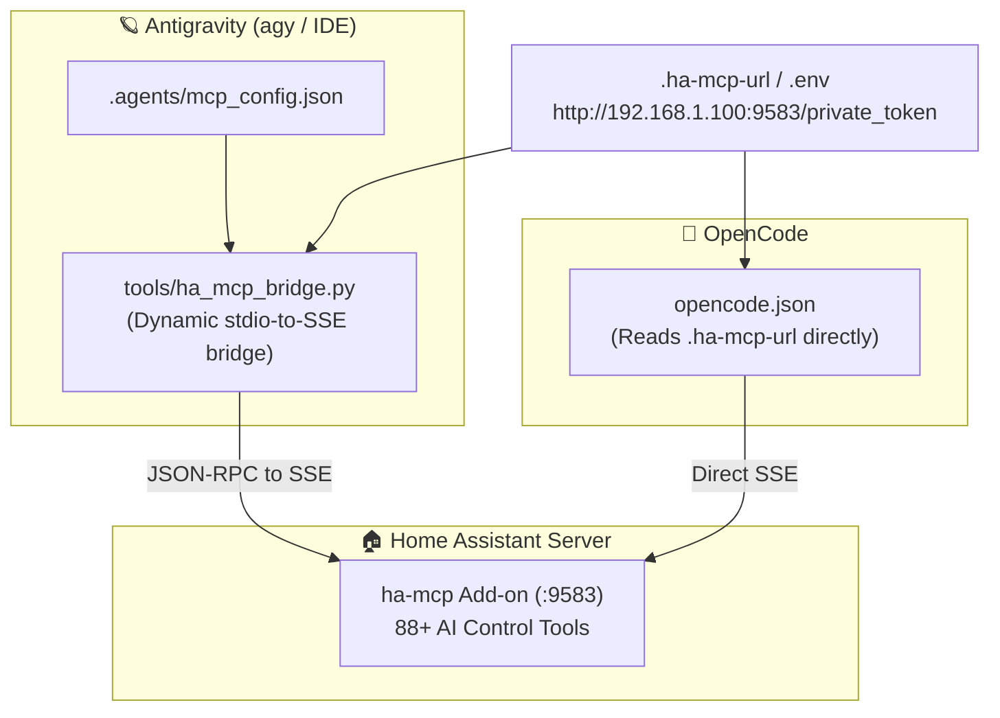
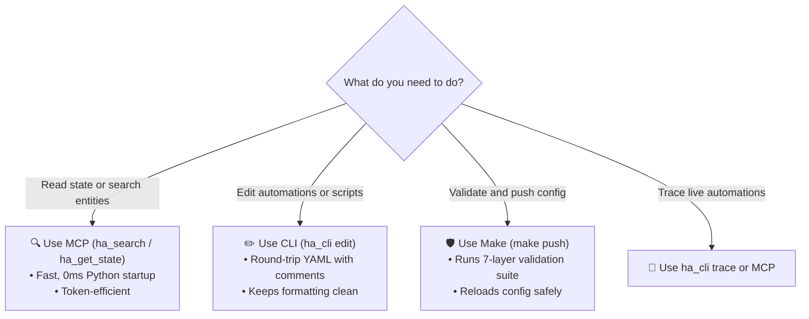
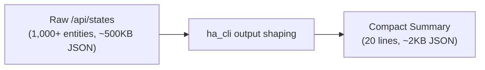

# 🤖 AI Assistant Integration & MCP Bridge

This repository is engineered to work as a native workspace for AI coding assistants (including **Antigravity**, **OpenCode**, and **Claude Code**).

---

## 🔌 Dual Harness Architecture

AI agents connect to Home Assistant via the [ha-mcp](https://github.com/homeassistant-ai/ha-mcp) Model Context Protocol (MCP) server running on port `9583`.

Both OpenCode and Antigravity share a single source of truth for connection settings:



---

## 🎯 Tool Decision Matrix: When to Use MCP vs CLI

AI agents (and developers) should pick the most efficient tool for each task:



### Detailed Breakdown

| Task | Recommended Tool | Why It's Best |
|---|---|---|
| **Find entities or config bodies** | **MCP `ha_search`** | Scans entity registry + automations in a single fast call |
| **Read entity state(s)** | **MCP `ha_get_state`** | Super lean JSON payload; reads up to 100 entities at once |
| **Edit local YAML** | **`ha_cli edit`** | Preserves comments and key ordering via `ruamel.yaml` |
| **Validate and deploy** | **`make push`** | Validates with 7 layers before rsyncing |
| **Check automation traces** | **`ha_cli trace` / MCP** | Lists recent executions and step breakdowns |
| **System or addon logs** | **MCP `ha_get_logs`** | Supports 6 sources with filtering |

---

## 🪶 Token Efficiency & Guardrails

To prevent LLM context windows from being overwhelmed by large entity lists, `ha_cli` provides built-in output-shaping flags:



### Useful CLI Guardrail Flags

```bash
# Filter by domain and grab only the first 5 entities
uv run python tools/ha_cli.py curl /api/states --domain light --first 5

# Pick specific fields to minimize token usage
uv run python tools/ha_cli.py curl /api/states --pick entity_id,state

# Truncate large payloads if they exceed character limits
uv run python tools/ha_cli.py curl /api/states --max-chars 500
```

---

## 🧩 Pre-Built AI Skills

The repository includes specialized skills in `.agents/skills/` to guide AI agents through complex multi-step workflows:

- **`home-assistant-backup`**: Pulls fresh state, generates diffs, and creates verified snapshot archives.
- **`home-assistant-automation`**: End-to-end guide for creating and modifying automations.
- **`home-assistant-debugging`**: Systematic root-cause diagnosis using logs, traces, and historical diffs.
- **`check-upgrade`**: Reviews intervening Home Assistant Core release notes for breaking changes before upgrading.
