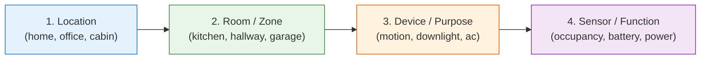
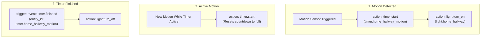
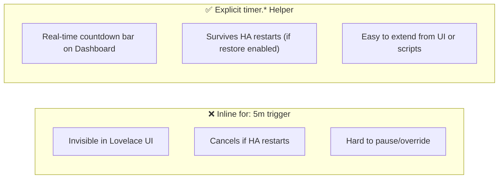
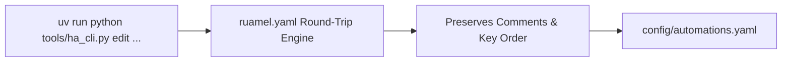
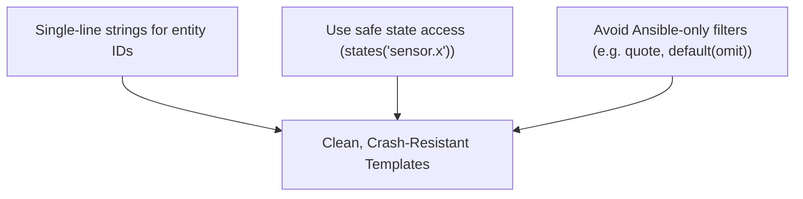

# 📐 Automation & Entity Design Guide

Writing clean, predictable automations keeps your smart home reliable and easy to maintain. This guide covers our naming standards, UI-visible timer patterns, and safe YAML editing.

---

## 🏷️ Entity Naming Convention

All entities in this system follow a standardized **4-segment hierarchical naming pattern**:

$$\Huge\texttt{location\_room\_device\_sensor}$$



### Real-World Examples

| Entity ID | Domain | Location | Room | Device | Function |
|---|---|---|---|---|---|
| `binary_sensor.home_kitchen_motion_occupancy` | `binary_sensor` | `home` | `kitchen` | `motion` | `occupancy` |
| `sensor.home_living_room_temp_battery` | `sensor` | `home` | `living_room` | `temp` | `battery` |
| `light.home_hallway_downlights` | `light` | `home` | `hallway` | `downlights` | - |
| `timer.home_bathroom_motion_timer` | `timer` | `home` | `bathroom` | `motion` | `timer` |

---

## ⏱️ Motion Lighting: Why We Use `timer.*` Helpers

A common mistake in Home Assistant is writing motion light automations with an inline `for:` delay trigger (e.g. "turn off after 5 minutes of no motion").

Instead, this system uses **explicit `timer.*` helper entities**:



### Why Timers are Better than Inline `for:`



> [!TIP]
> **Dashboard Visibility:** Because timers are real entities in Home Assistant, your Lovelace room cards can display a live countdown bar showing exactly how many seconds remain before the lights turn off!

---

## ✏️ Safe YAML Editing with `ha_cli edit`

Never use simple text replaces on large YAML files—it destroys comments, changes indentation, and reformats clean lists.

Use the built-in `ha_cli edit` tool (powered by `ruamel.yaml` round-trip parser):



### Common Editing Commands

```bash
# 1. List all automations by alias
uv run python tools/ha_cli.py edit automations

# 2. View a specific automation
uv run python tools/ha_cli.py edit automations "Hallway Motion Lights"

# 3. Add a new automation safely
uv run python tools/ha_cli.py edit automations --add '{"alias":"Garage Open Alert","trigger":[],"action":[]}'

# 4. Modify fields without retyping the whole automation
uv run python tools/ha_cli.py edit automations "Hallway Motion Lights" --set mode=restart icon=mdi:motion-sensor

# 5. Remove an automation cleanly
uv run python tools/ha_cli.py edit automations "Old Test Automation" --remove
```

---

## 🧩 Jinja2 Template Best Practices

Home Assistant uses Jinja2 for dynamic logic. Follow these safety rules:



1. **Avoid Multi-Line Whitespace in URLs/IDs**:
   ```yaml
   # ❌ BAD: Line breaks insert unwanted whitespace/newlines
   action:
     - action: notify.mobile_app
       data:
         message: >
           {{ states('sensor.temp') }}
   
   # ✅ GOOD: Keep inline templates compact
   action:
     - action: notify.mobile_app
       data:
         message: "The temperature is {{ states('sensor.temp') }}°C"
   ```

2. **Use `states('sensor.name')` instead of direct attribute access**:
   - `states('sensor.kitchen_temp')` safely returns `'unknown'` if offline.
   - `states.sensor.kitchen_temp.state` will **throw a fatal error** if the sensor is not loaded.
