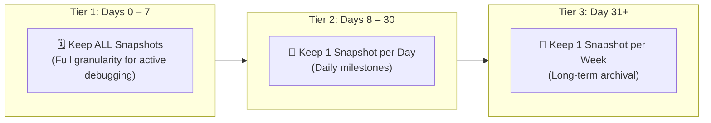
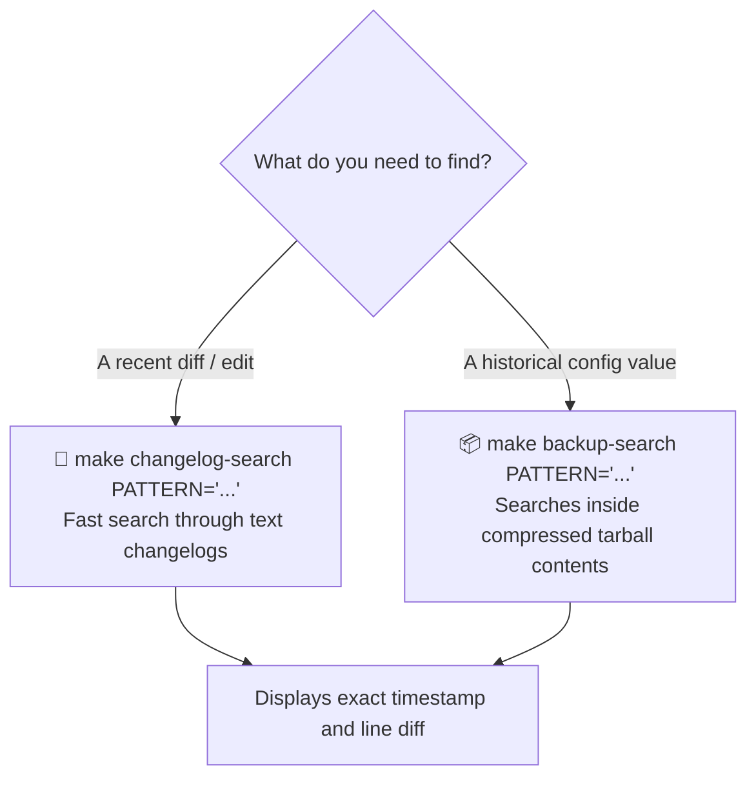
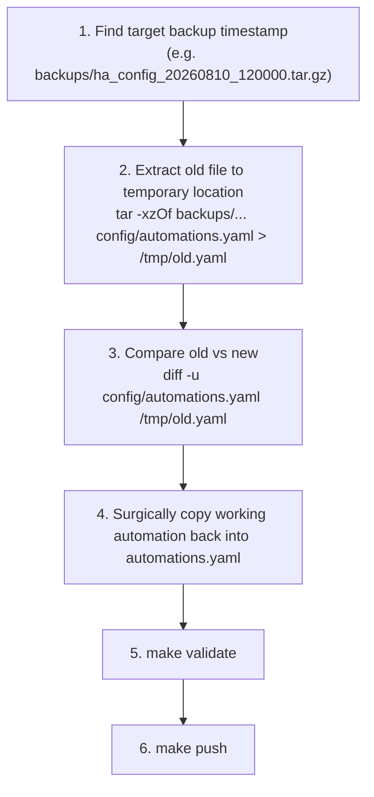

# 💾 Backups, Changelogs & Disaster Recovery

Because configuration files are deployed directly to Home Assistant rather than stored in git history, the **local backup snapshot system (`backups/`)** is your primary safety net and historical record.

---

## 📅 Smart Backup Retention Policy

Running `make backup` creates a local, timestamped `.tar.gz` archive of your configuration. Over time, `prune_backups.py` cleans up old backups automatically according to a 3-tier retention schedule:



### Pruning Commands
```bash
# Preview pruning plan without deleting anything (dry-run)
uv run python tools/prune_backups.py

# Apply pruning plan (safe floor ensures at least 3 backups are kept)
uv run python tools/prune_backups.py --apply
```

---

## 🔍 Finding When Something Changed

When an automation stops working or an entity behaves unexpectedly, you can quickly find when it was modified:



### Useful Search Commands

```bash
# 1. Search text changelogs for modifications to an entity (last 7 days)
make changelog-search PATTERN='climate.living_room' DAYS=7

# 2. Search all backup archives for historical occurrences
make backup-search PATTERN='light.hallway_downlights' LIMIT=5
```

---

## 🚑 Step-by-Step Disaster Recovery Runbook

If you accidentally delete or break an automation and need to restore it from an earlier backup:



### Copy-Paste Restore Commands

```bash
# Step 1: Extract the historical automations file to /tmp
tar -xzOf backups/ha_config_20260810_120000.tar.gz config/automations.yaml > /tmp/old_automations.yaml

# Step 2: Compare differences
diff -u config/automations.yaml /tmp/old_automations.yaml

# Step 3: Once restored, validate and deploy
make validate
make push
```

> [!IMPORTANT]
> **Surgical Restores Only:** Avoid blindly replacing your entire `config/` folder with an old backup archive. Instead, diff and restore only the specific automation, script, or template that broke.
