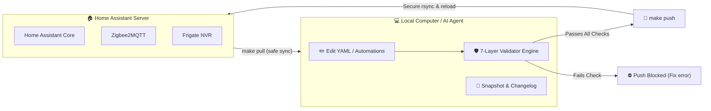
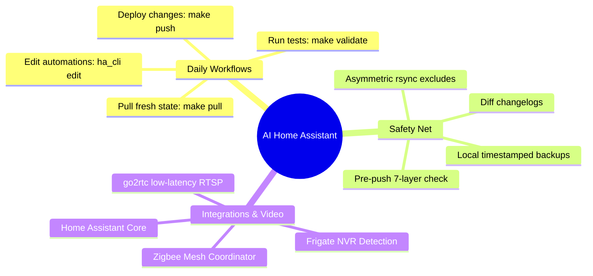

# 🏠 Home Assistant Config & Automation Manager Wiki

Welcome to the **AI Home Assistant Config Manager** documentation! 

This repository provides an automated, safe, and AI-assisted workflow for managing a smart home powered by **Home Assistant**, **Zigbee2MQTT**, and **Frigate NVR**.

---

## 🌟 What is This Project?

Managing a complex smart home configuration by hand can be scary:
- One syntax typo in YAML can break all your automations.
- Deleting an entity can leave broken cards on your wall dashboards.
- Battery-powered Zigbee sensors might drop offline silently.

This toolkit solves these problems by providing a **local development environment** with **multi-layer automated validation**, **round-trip safe YAML editing**, **automated backups**, and **AI coding assistant integrations**.

---

## 🧭 Wiki Table of Contents

Browse the guides below. Each page is written with plenty of diagrams and clear step-by-step instructions:

<table>
<tr>
<td width="50%">

### 🏗️ [1. System Architecture](System-and-Hardware-Architecture)
- System topology & coordinator setup
- 4-Channel communication model (SSH, REST, WS, MCP)
- The Push vs. Pull rsync safety boundary

</td>
<td width="50%">

### 🛡️ [2. Validation & Deployment Engine](Validation-and-Deployment-Engine)
- The 7-layer validation pipeline explained
- Parallel execution & SHA256 caching
- Step-by-step create/edit/push deployment flow

</td>
</tr>
<tr>
<td width="50%">

### 🔌 [3. Integrations & Runbooks](Integrations-and-Runbooks)
- Frigate NVR AI setup & stream routing
- Zigbee2MQTT naming rules & the 250ms timing rule
- Lovelace storage mode & Google Cast quirks

</td>
<td width="50%">

### 📐 [4. Automation & Entity Standards](Automation-and-Entity-Design)
- Entity naming convention (`location_room_device_sensor`)
- Why we use `timer.*` helpers for motion lights
- Safe YAML editing with `ha_cli edit`

</td>
</tr>
<tr>
<td width="50%">

### 💾 [5. Backups & Disaster Recovery](Backups-and-Disaster-Recovery)
- Automated backup snapshots & smart retention tiers
- Searching diff changelogs with `make changelog-search`
- Step-by-step disaster recovery & config extraction

</td>
<td width="50%">

### 🤖 [6. AI Assistant Integration](AI-Assistant-Integration)
- MCP server setup (`ha-mcp` on port 9583)
- Tool decision matrix (When to use MCP vs CLI)
- Pre-built skills for OpenCode, Antigravity & Claude

</td>
</tr>
<tr>
<td colspan="2">

### 🔧 [7. Troubleshooting & FAQs](Troubleshooting-and-FAQ)
- Interactive solutions for validation errors, SSH hiccups, stale battery sensors, and cache clearing

</td>
</tr>
</table>

---

## 🚀 Quick Navigation Cards

---

> [!TIP]
> **New to the repo?** Start by reading [System Architecture](System-and-Hardware-Architecture) to understand how your local machine talks to Home Assistant!
