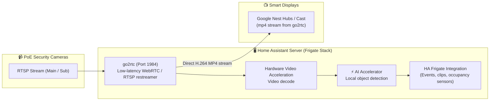
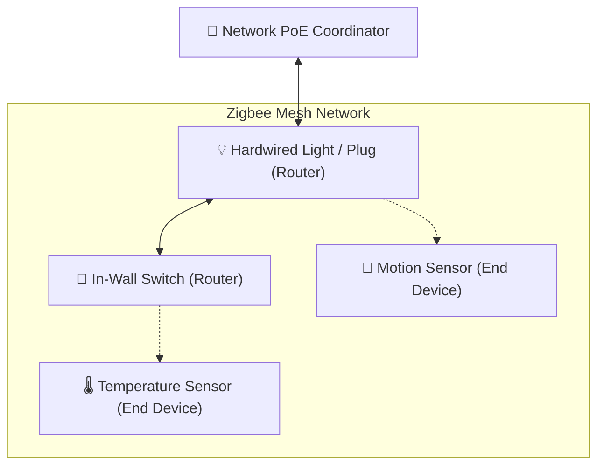
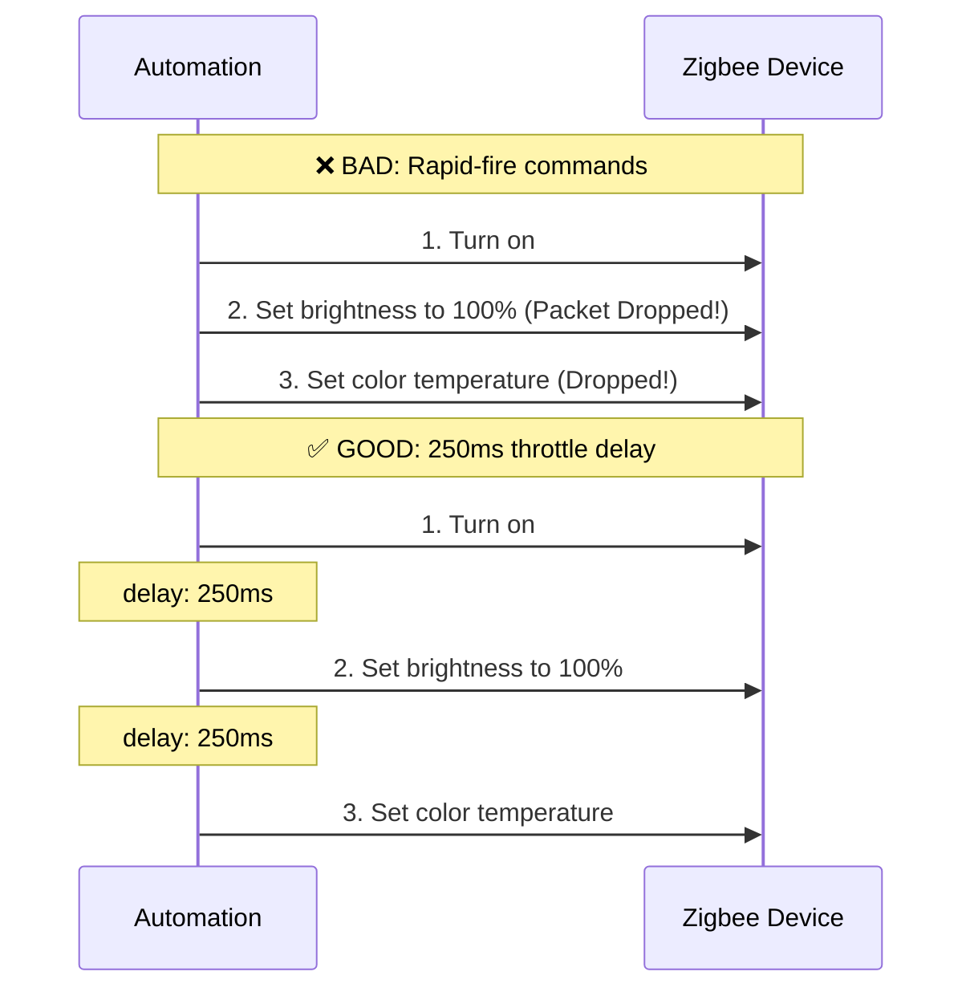
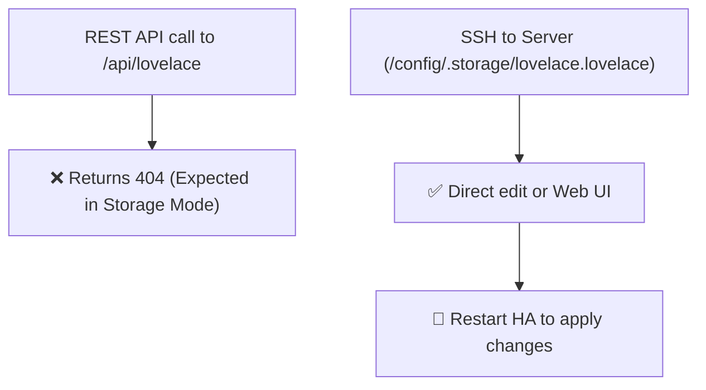

# 🔌 Integrations & Runbooks

This guide covers operational best practices and critical gotchas for our main smart home integrations: **Frigate NVR**, **Zigbee2MQTT**, **go2rtc Streaming**, and **Lovelace Dashboards**.

---

## 📹 Frigate NVR & AI Computer Vision

Frigate processes RTSP camera streams using local hardware acceleration:



### 🚨 Critical Gotcha: Streaming to Google Cast / Nest Displays

| Method | Syntax | Status | Why |
|---|---|---|---|
| ❌ `camera.play_stream` | `action: camera.play_stream` | **BROKEN (500 Error)** | HA's internal HLS stream packaging fails on Google Cast devices |
| ✅ **go2rtc MP4 Direct** | `action: media_player.play_media` | **FAST & STABLE** | Uses go2rtc's direct MP4 repackaging on port 1984 |

#### Correct Automation Example:
```yaml
action:
  - action: media_player.play_media
    target:
      entity_id: media_player.kitchen_display
    data:
      media_content_id: "http://192.168.1.100:1984/api/stream.mp4?src=driveway"
      media_content_type: "video/mp4"
```

> [!WARNING]
> **Stopping Cast Streams:** Always use `action: media_player.turn_off` (NOT `media_player.media_stop`) to dismiss active camera streams on Google Nest Hubs.

---

## 🐝 Zigbee2MQTT (Z2M) & The 250ms Delay Rule

Our Zigbee network uses a **Network PoE Coordinator** communicating over Ethernet.



### ⚠️ The 250ms Inter-Command Delay Rule

Zigbee radios can become overwhelmed if bombarded with rapid back-to-back commands for the same device (causing missed commands or dropped packets).



Always insert a short `delay: "00:00:00.250"` between multiple sequential commands sent to the same Zigbee entity.

---

## 🖼️ Lovelace Dashboard Storage Mode

Home Assistant dashboards are managed in **Storage Mode** (`.storage/lovelace.lovelace`).



### Dashboard Entity Cleanup Checklist
When you rename or delete an entity, helper, or timer:
1. **Audit Dashboard Cards**: Check if the old entity name is still in `.storage/lovelace.lovelace`.
2. **Remove Orphaned Cards**: Leaving deleted entities on cards causes ugly "Entity Not Available" warnings in the UI.
