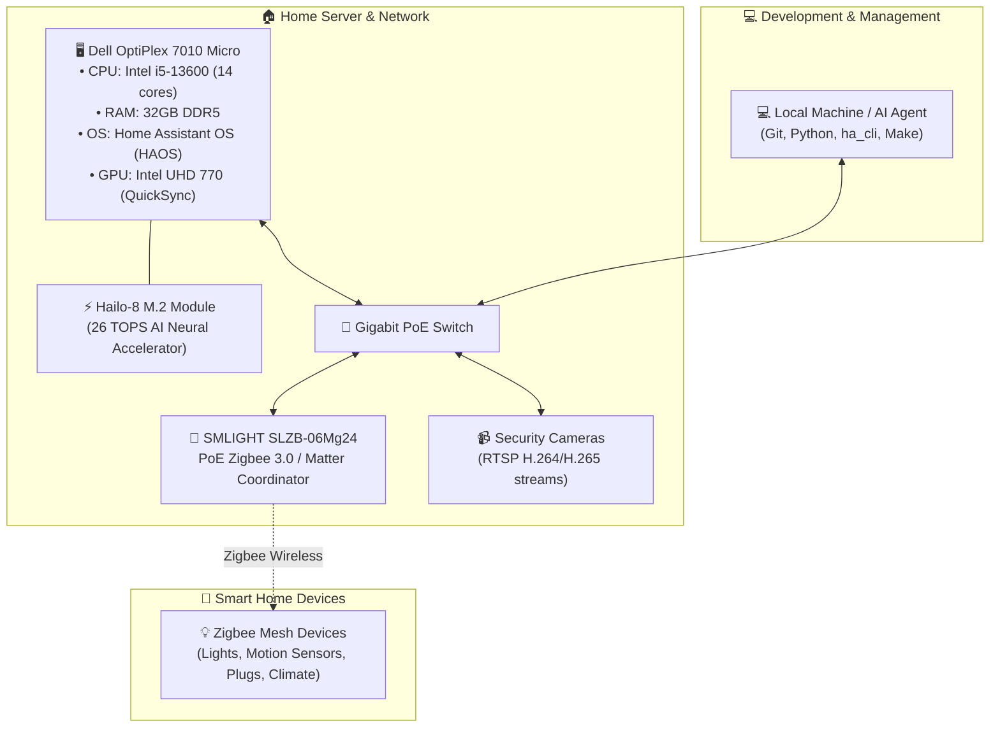
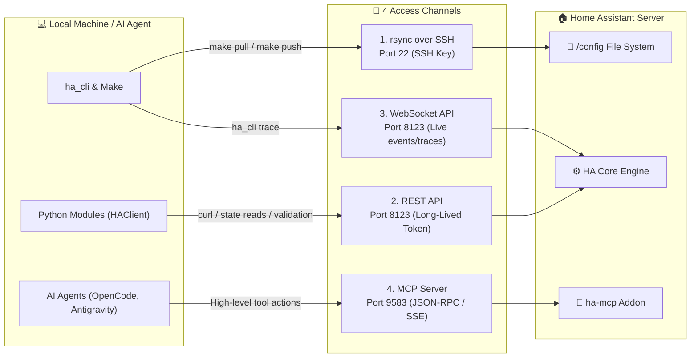
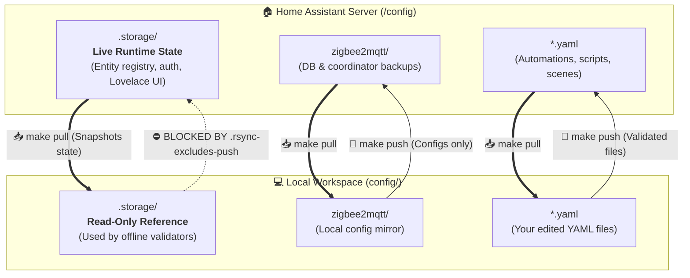

# 🏗️ System & Hardware Architecture

This page outlines the physical hardware, network layout, software components, and communication channels that make up this smart home system.

---

## 🖥️ Physical Hardware Stack

The system runs on dedicated local hardware designed for reliability, fast AI computer vision processing, and low-latency Zigbee communication:

### Key Hardware Components

| Component | Hardware Model | Purpose | Why It's Chosen |
|---|---|---|---|
| **Host Server** | Dell OptiPlex 7010 Micro | Main Home Assistant Server | Compact, low power (~25W idle), PCIe/M.2 expandability, DDR5 speed |
| **AI Co-Processor** | Hailo-8 M.2 (26 TOPS) | Frigate Object Detection | Runs real-time AI object detection on multiple cameras with near-zero CPU load |
| **Hardware Video** | Intel QuickSync (UHD 770) | Camera stream transcoding | Hardware-accelerated decoding/encoding for go2rtc and web live-streams |
| **Zigbee Gateway** | SMLIGHT SLZB-06Mg24 | Zigbee 3.0 / Matter Coordinator | **PoE-powered** over Ethernet; can be placed centrally in the home away from server interference |

---

## 📡 The 4 Communication Channels

Your local computer (and AI assistants) interact with Home Assistant through **four distinct channels**, each specialized for a specific job:

### Channel Comparison Table

| Channel | Protocol / Port | Auth Method | Used For | Why Needed |
|---|---|---|---|---|
| **1. rsync over SSH** | SSH (Port 22) | Ed25519 Key | `make pull`, `make push` | Fast, incremental file synchronization of your YAML configs and blueprints. |
| **2. REST API** | HTTP (Port 8123) | Bearer Token (`HA_TOKEN`) | `ha_cli curl`, `make reload`, validator checks | Standard programmatic API for reading states, rendering Jinja2 templates, and triggering reloads. |
| **3. WebSocket API** | WS (Port 8123) | Bearer Token | `ha_cli trace` | Real-time bi-directional streaming of automation execution traces and live bus events. |
| **4. MCP Server** | HTTP / SSE (Port 9583) | Private Token URL | AI Agent Tools | High-level natural-language tools (88+ tools) allowing AI to read states, search configs, and test services cleanly. |

---

## 🔄 The Asymmetric Rsync Safety Boundary

The most critical safety feature in this repository is the **asymmetric push/pull design**:

### Why is `.storage/` Never Pushed?

- **`.storage/` contains Home Assistant's internal database of live entities, tokens, and device states.**
- **During `make pull`:** `.storage/` is copied locally so the local validator (`EntityReferenceValidator`) can check if referenced sensors actually exist without having to query the server each time.
- **During `make push`:** `.rsync-excludes-push` strictly blocks `.storage/` from being sent back. If local files ever overwrote `.storage/`, it would corrupt the live entity registry and erase newly paired devices!

---

> [!IMPORTANT]
> **Golden Rule:** Never manually edit files inside `config/.storage/` on your local computer. If you need to make changes to dashboard UI or entity registries, use Home Assistant's web UI, MCP tools, or SSH directly.
