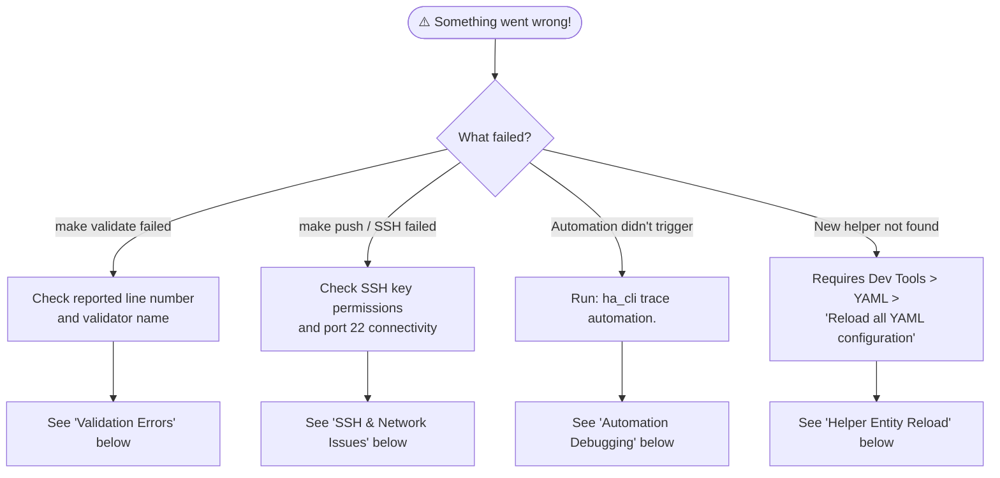
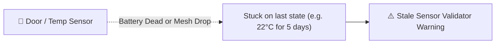

# 🔧 Troubleshooting & FAQs

This page provides interactive solutions to the most common issues you might encounter while managing Home Assistant configurations.

---

## 🧭 Visual Troubleshooting Flowchart



---

## 🛠️ Interactive Solutions & Runbooks

<details>
<summary><b>1. 🛑 Validation Error: "Unknown Entity Reference"</b></summary>

### Cause:
An automation or template references an entity (e.g. `light.kitchen_lights`) that does not exist in your local `.storage/` entity registry.

### How to Fix:
1. **Did you recently add or rename the entity on Home Assistant?**
   Run `make pull` to refresh your local entity snapshot:
   ```bash
   make pull
   ```
2. **Is there a typo in the entity ID?**
   Search for the exact entity name using MCP or grep:
   ```bash
   uv run python tools/ha_cli.py curl /api/states --domain light --pick entity_id
   ```
3. **Is it a helper defined in `configuration.yaml`?**
   If you created a new helper directly in YAML, Home Assistant needs a full YAML reload before it exposes the entity to the registry.

</details>

---

<details>
<summary><b>2. 🔑 SSH Connection Refused or Permission Denied</b></summary>

### Cause:
`make push` or `make pull` fails to connect over SSH to `HA_HOST`.

### Checklist:
1. **Check SSH Key Permissions**:
   ```bash
   chmod 600 ~/.ssh/homeassistant
   chmod 700 ~/.ssh
   ```
2. **Test Direct SSH Connection**:
   ```bash
   ssh -v homeassistant
   ```
3. **Verify Advanced SSH Add-on in Home Assistant**:
   - Ensure the add-on is started.
   - Verify port `22` is exposed and your public key is added under `authorized_keys`.

</details>

---

<details>
<summary><b>3. 🔋 Stale Sensor Warnings (Zigbee Battery Sensors)</b></summary>

### Cause:
The stale sensors validator checks if sensors have reported state changes recently. Battery-powered sensors that drop off the Zigbee mesh or run out of battery often freeze at their last known reading.



### How to Fix:
1. Check the battery level on the physical device.
2. In Zigbee2MQTT, verify if the device is showing as "Offline" or has high LQI (packet drop).
3. Tap the physical pairing button on the sensor to wake it up and send a heartbeat.

</details>

---

<details>
<summary><b>4. 🧹 How to Clear Validator Cache</b></summary>

### Cause:
If validator results appear stale or you want to force a clean run of all 7 layers from scratch:

```bash
# Option A: Force re-run bypassing cache
uv run python tools/ha_cli.py validate --force

# Option B: Delete the cache directory
rm -rf config/.cache/validators/
```

</details>

---

<details>
<summary><b>5. 🖼️ Lovelace Dashboard 404 Errors</b></summary>

### Cause:
Calling `/api/lovelace` via REST returns `404 Not Found`.

### Explanation:
Home Assistant operates in **Storage Mode** by default. Dashboards are stored inside `.storage/lovelace.lovelace` rather than exposed over the legacy REST endpoint.

### How to Edit:
1. Use the Home Assistant Web UI.
2. Or SSH to the server and edit `/config/.storage/lovelace.lovelace`, then restart Home Assistant.

</details>
