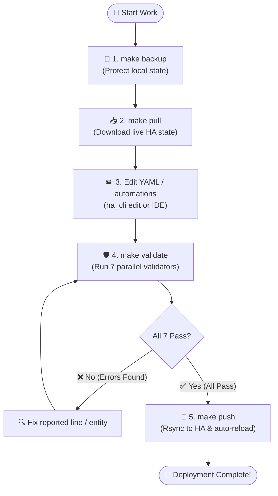
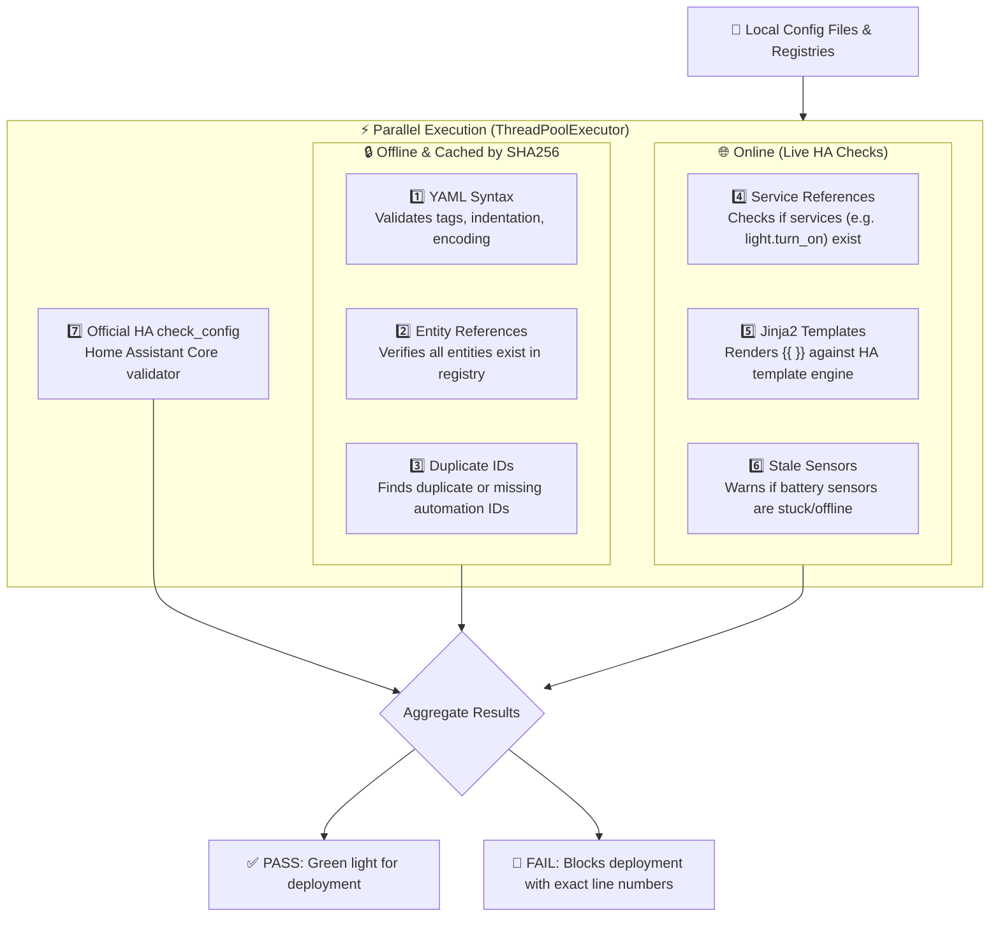
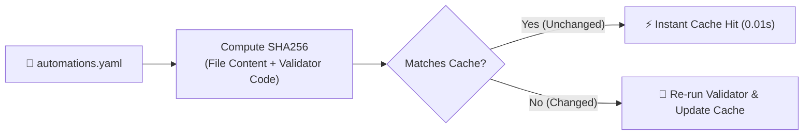
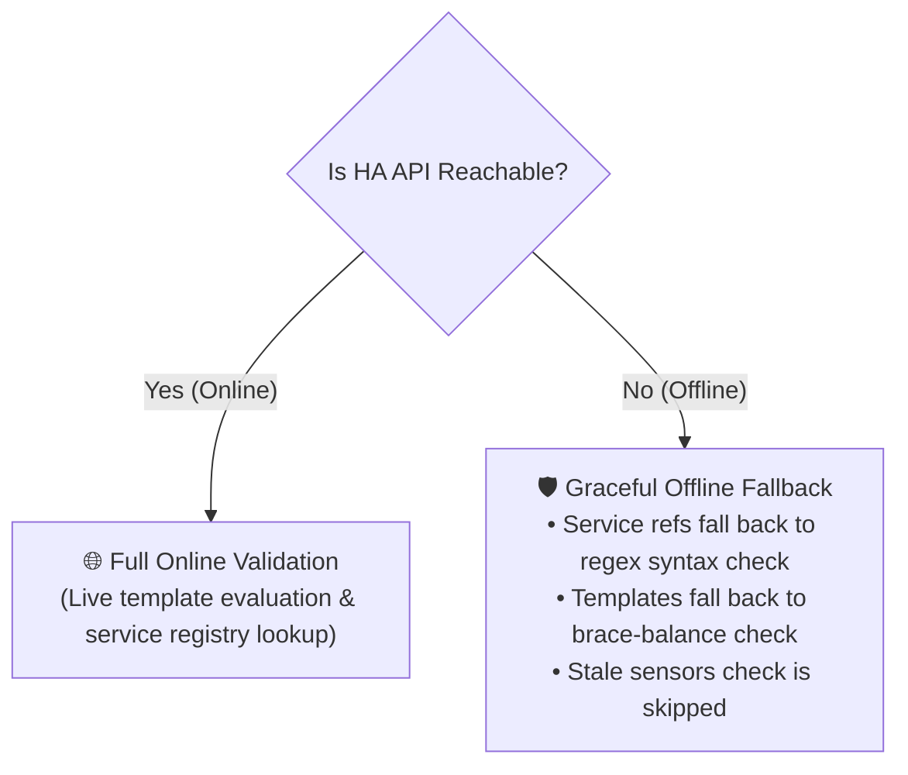

# 🛡️ Validation & Deployment Engine

To prevent broken configurations or bad syntax from crashing your Home Assistant server, this toolkit runs a comprehensive **7-layer validation engine** before every deployment.

---

## 🔄 The Complete Lifecycle

Here is what happens during a standard configuration workflow:



---

## ⚡ The 7 Validation Layers

All 7 validators run concurrently in a multi-threaded pool for maximum speed:



### Deep Dive into Each Validator

| # | Validator Name | What It Checks | Why It Matters |
|---|---|---|---|
| **1** | **YAML Syntax** | Validates proper YAML structure, HA tags (`!include`, `!secret`), and UTF-8 encoding | Prevents syntax errors from crashing HA startup. |
| **2** | **Entity References** | Scans YAML and templates to ensure referenced entities (`light.kitchen`, `sensor.bedroom_temp`) exist in `.storage/` | Prevents broken automations from silently failing when an entity is renamed. |
| **3** | **Duplicate IDs** | Verifies every automation has a unique `id:` field | Duplicate IDs cause automations to overwrite each other in the UI and break execution traces. |
| **4** | **Service References** | Verifies services like `light.turn_on` or `climate.set_temperature` are valid | Catches typos like `light.turn_onn` before you deploy. |
| **5** | **Jinja2 Templates** | Evaluates template expressions (`{{ ... }}`) using Home Assistant's `/api/template` endpoint | Catches invalid Jinja filters or missing parentheses. |
| **6** | **Stale Sensors** | Compares `last_updated` timestamps on sensors against a staleness threshold | Alerts you to dead battery sensors or disconnected Zigbee devices. |
| **7** | **Official HA Validation** | Runs Home Assistant's built-in `check_config` script | Guarantees full compatibility with Home Assistant Core. |

---

## ⚡ High-Speed Caching (SHA256)

Running full validation takes time. To keep feedback instant (~0.1s), file-backed validators use a SHA256 hash cache stored in `config/.cache/validators/`.



### Caching Rules:
- **Instant hits**: If `automations.yaml` hasn't changed, the YAML and Duplicate ID validators finish in under 10ms.
- **Failures never cache**: If an error is detected, it will always re-run until fixed.
- **Force refresh**: Run `uv run python tools/ha_cli.py validate --force` to bypass the cache.

---

## 🌐 Graceful Offline Fallback

If Home Assistant is temporarily restarting or your network is offline, the validation suite does **not** crash. Instead, online validators degrade gracefully:



---

## 🛠️ Handy Validation Commands

```bash
# Run all validators (auto-detects summary for terminals vs pipes)
uv run python tools/ha_cli.py validate

# Force re-run all validators (ignore cache)
uv run python tools/ha_cli.py validate --force

# Quiet mode (only print errors/warnings)
uv run python tools/ha_cli.py validate --quiet
```
